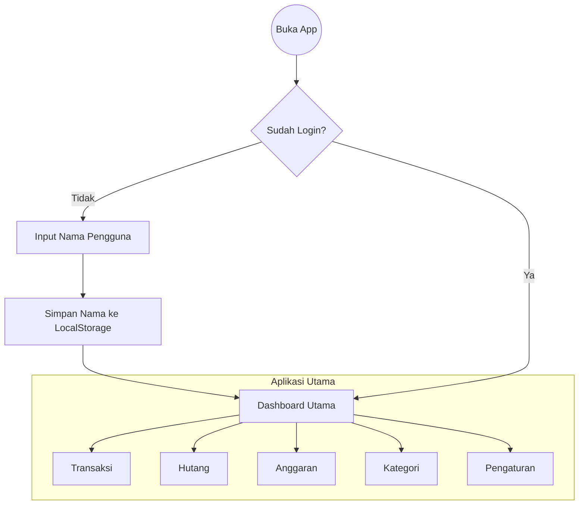

# Rencana Frontend FinBro (Revisi: Desktop & Glassmorphism)

Dokumen ini berisi rencana pengembangan frontend aplikasi FinBro yang telah direvisi untuk fokus pada tampilan Desktop (Landscape) dengan gaya modern Glassmorphism.

## 1. Prinsip Desain (Design Principles)

*   **Platform Target:** PC / Desktop (Landscape Layout).
*   **Tema:** **Dark Mode** (Default).
*   **Gaya Visual:** **Glassmorphism** (Efek kaca buram/frosted glass, transparansi, border tipis, glow halus).
*   **Warna Utama:** **Dark Purple** (Ungu Gelap) sebagai aksen utama untuk memberikan kesan elegan dan futuristik.
*   **Bahasa:** Default Bahasa Indonesia (Opsi ganti ke Inggris).
*   **Mata Uang:** Default IDR (Rp) (Opsi ganti ke USD).

## 2. Alur Navigasi (Mermaid Flow Chart)

Alur pengguna saat pertama kali membuka aplikasi hingga masuk ke dashboard utama.



## 3. Struktur Navigasi (Desktop Sidebar)

Aplikasi menggunakan layout **Sidebar Kiri** yang persisten.

### Header Area (Top Bar)
*   **Kiri:** Logo FinBro.
*   **Tengah/Kanan:**
    *   Sapaan: "Selamat Datang, [Nama User]!"
    *   Widget Jam & Tanggal (Realtime sesuai lokasi user).
    *   Avatar/Profil Picture.

### Sidebar Menu
1.  **Dashboard** (Ringkasan & Grafik)
2.  **Transaksi** (Riwayat & Input)
3.  **Hutang** (Pencatatan Hutang/Piutang) - *Fitur Baru*
4.  **Anggaran** (Budgeting)
5.  **Kategori** (Manajemen Kategori)

... (Spacer) ...

6.  **Pengaturan** (Di pojok kiri bawah)

## 4. ASCII Wireframe (Visualisasi Layout)

Berikut adalah sketsa kasar tampilan antarmuka untuk setiap halaman.

### A. Layout Utama & Dashboard
```text
+------------------+-----------------------------------------------------------------------+
|  FinBro [Logo]   |  Selamat Datang, Fahri!        [Kamis, 5 Feb 2026 14:30]     (O) User |
+------------------+-----------------------------------------------------------------------+
| [ Sidebar Menu ] |  [ Dashboard Content ]                                                |
|                  |                                                                       |
|  1. Dashboard    |  +-----------------------+  +-----------------------+                 |
|  2. Transaksi    |  | Total Saldo           |  | Sisa Budget Bulan Ini |                 |
|  3. Hutang       |  | Rp 15.000.000         |  | [||||||||||....] 70% |                 |
|  4. Anggaran     |  |                       |  | (Bisa Diatur)         |                 |
|  5. Kategori     |  +-----------------------+  +-----------------------+                 |
|                  |                                                                       |
|                  |  +---------------------------------------------------------------+    |
|                  |  | [ Line Chart - Smooth Curve ]                                 |    |
|                  |  | (Opsi: 7 Hari Terakhir | 1 Bulan Terakhir)                    |    |
|                  |  |                                                               |    |
|                  |  |      /```\      /```\                                         |    |
|                  |  |     /     \    /     \                                        |    |
|  6. Pengaturan   |  | ___/       \__/       \______________________________________ |    |
|                  |  +---------------------------------------------------------------+    |
|                  |                                                                       |
|                  |  +---------------------------------------------------------------+    |
|                  |  | Transaksi Terbaru                                             |    |
|                  |  | [Makan Siang] - Rp 25.000   [Gaji] + Rp 10.000.000            |    |
|                  |  +---------------------------------------------------------------+    |
+------------------+-----------------------------------------------------------------------+
```

### B. Tab Transaksi
```text
+------------------+-----------------------------------------------------------------------+
| ...Header...     |                                                                       |
+------------------+-----------------------------------------------------------------------+
| ...Sidebar...    |  [ Judul: Riwayat Transaksi ]          [ + Tambah Transaksi Baru ]    |
|                  |                                                                       |
|                  |  Filter: [Semua] [Pemasukan] [Pengeluaran] | [Bulan Ini v]            |
|                  |                                                                       |
|                  |  +---------------------------------------------------------------+    |
|                  |  | Tgl  | Kategori  | Deskripsi       | Nominal      | Aksi      |    |
|                  |  |------+-----------+-----------------+--------------+-----------|    |
|                  |  | 05/02| Makanan   | Nasi Padang     | - Rp 25.000  | [Edit][X] |    |
|                  |  | 01/02| Gaji      | Gaji Februari   | + Rp 10jt    | [Edit][X] |    |
|                  |  | ...  | ...       | ...             | ...          | ...       |    |
|                  |  +---------------------------------------------------------------+    |
|                  |                                                                       |
+------------------+-----------------------------------------------------------------------+
```

### C. Tab Hutang (Debt)
```text
+------------------+-----------------------------------------------------------------------+
| ...Header...     |                                                                       |
+------------------+-----------------------------------------------------------------------+
| ...Sidebar...    |  [ Judul: Daftar Hutang & Piutang ]    [ + Catat Hutang Baru ]        |
|                  |                                                                       |
|                  |  +-----------------------+  +-----------------------+                 |
|                  |  | Total Saya Berhutang  |  | Total Orang Berhutang |                 |
|                  |  | Rp 500.000            |  | Rp 200.000            |                 |
|                  |  +-----------------------+  +-----------------------+                 |
|                  |                                                                       |
|                  |  +---------------------------------------------------------------+    |
|                  |  | Nama    | Tgl Pinjam | Jth Tempo | Jumlah      | Status     |    |
|                  |  |---------+------------+-----------+-------------+------------|    |
|                  |  | Budi    | 01/02      | 10/02     | Rp 100.000  | Belum Lunas|    |
|                  |  | Andi    | 20/01      | 30/01     | Rp 50.000   | Lunas (v)  |    |
|                  |  +---------------------------------------------------------------+    |
+------------------+-----------------------------------------------------------------------+
```

### D. Tab Anggaran (Budget)
```text
+------------------+-----------------------------------------------------------------------+
| ...Header...     |                                                                       |
+------------------+-----------------------------------------------------------------------+
| ...Sidebar...    |  [ Judul: Atur Anggaran Bulanan ]                                     |
|                  |                                                                       |
|                  |  Target Pengeluaran Bulan Ini: [ Rp 5.000.000 ]  [Simpan]             |
|                  |                                                                       |
|                  |  Alokasi Per Kategori:                                                |
|                  |  +---------------------------------------------------------------+    |
|                  |  | Makanan       : [ Rp 2.000.000 ]  [======----] 60%            |    |
|                  |  | Transport     : [ Rp 1.000.000 ]  [==--------] 20%            |    |
|                  |  | Hiburan       : [ Rp 500.000   ]  [----------] 0%             |    |
|                  |  +---------------------------------------------------------------+    |
|                  |  [ + Tambah Budget Kategori Lain ]                                    |
+------------------+-----------------------------------------------------------------------+
```

### E. Tab Kategori
```text
+------------------+-----------------------------------------------------------------------+
| ...Header...     |                                                                       |
+------------------+-----------------------------------------------------------------------+
| ...Sidebar...    |  [ Judul: Manajemen Kategori ]         [ + Tambah Kategori ]          |
|                  |                                                                       |
|                  |  Tipe: (o) Pengeluaran  ( ) Pemasukan                                 |
|                  |                                                                       |
|                  |  Grid Kategori:                                                       |
|                  |  +-------------+   +-------------+   +-------------+                  |
|                  |  | [Icon]      |   | [Icon]      |   | [Icon]      |                  |
|                  |  | Makanan     |   | Transport   |   | Belanja     |                  |
|                  |  | [Edit/Hapus]|   | [Edit/Hapus]|   | [Edit/Hapus]|                  |
|                  |  +-------------+   +-------------+   +-------------+                  |
|                  |                                                                       |
+------------------+-----------------------------------------------------------------------+
```

### F. Tab Pengaturan
```text
+------------------+-----------------------------------------------------------------------+
| ...Header...     |                                                                       |
+------------------+-----------------------------------------------------------------------+
| ...Sidebar...    |  [ Judul: Pengaturan Aplikasi ]                                       |
|                  |                                                                       |
|                  |  Preferensi Umum                                                      |
|                  |  --------------------------------------------------                   |
|                  |  Mata Uang       : [ IDR (Rp) v ]  (Opsi: USD)                        |
|                  |  Bahasa          : [ Indonesia v ] (Opsi: English)                    |
|                  |  Format Tanggal  : [ DD/MM/YYYY v ]                                   |
|                  |                                                                       |
|                  |  Data (Backup & Restore)                                              |
|                  |  --------------------------------------------------                   |
|                  |  [ Export JSON ] [ Import JSON ] [ Export CSV ]                       |
|                  |  [ Hapus Semua Data (Reset) ]                                         |
|                  |                                                                       |
|                  |  Tentang Aplikasi (About)                                             |
|                  |  --------------------------------------------------                   |
|                  |  Aplikasi manajemen keuangan personal dengan gaya glassmorphism.      |
|                  |                                                                       |
|                  |  Dibuat oleh: Fahriza                                                 |
|                  |  Instagram: @fahrizaafg                                               |
+------------------+-----------------------------------------------------------------------+
```

## 5. Rencana Implementasi Teknis

1.  **Framework:** React (Vite)
2.  **Language:** TypeScript (Rekomendasi) atau JavaScript.
3.  **Styling:** Tailwind CSS + Custom CSS untuk efek Glassmorphism (`backdrop-filter: blur`, `bg-opacity`, `border-white/20`).
4.  **Charts:** Recharts (sangat support untuk custom SVG line chart yang smooth).
5.  **Icons:** Lucide React / Heroicons.
6.  **State Management:** React Context / Zustand.
7.  **Persistensi Data:** LocalStorage (untuk MVP tanpa backend).
